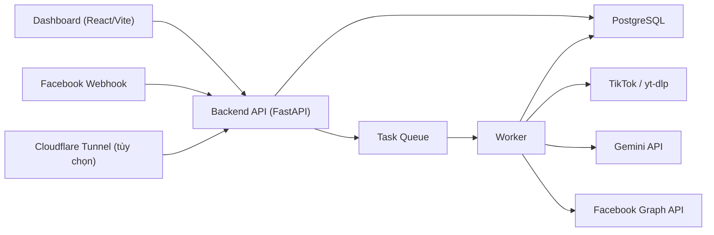

# Social Tool


Hệ thống tự động hóa vận hành Facebook Page theo hướng "một dashboard để quản lý tất cả": crawl video từ TikTok và YouTube Shorts, tạo chiến dịch, xếp lịch đăng Facebook Reels, sinh caption bằng AI, trả lời bình luận tự động, trả lời inbox tự động, theo dõi worker/task queue, cấu hình runtime ngay trên giao diện, và quản lý người dùng theo vai trò.

README này được viết lại theo đúng trạng thái hiện tại của mã nguồn trong repo, không phải mô tả ý tưởng cũ.

Tài liệu này ưu tiên 2 nhóm người đọc:

- người vận hành muốn chạy hệ thống thật nhanh
- người kỹ thuật muốn hiểu rõ kiến trúc, luồng dữ liệu và cách triển khai

## Mục Lục

- [1. Dự án này là gì](#1-dự-án-này-là-gì)
- [2. Hệ thống hiện đang có những gì](#2-hệ-thống-hiện-đang-có-những-gì)
- [3. Kiến trúc tổng thể](#3-kiến-trúc-tổng-thể)
- [4. Thành phần chính](#4-thành-phần-chính)
- [5. Luồng hoạt động end-to-end](#5-luồng-hoạt-động-end-to-end)
- [6. Tính năng chi tiết](#6-tính-năng-chi-tiết)
- [7. Dashboard hiện có những khu nào](#7-dashboard-hiện-có-những-khu-nào)
- [8. Cấu trúc dữ liệu chính](#8-cấu-trúc-dữ-liệu-chính)
- [9. Chạy nhanh với Docker](#9-chạy-nhanh-với-docker)
- [10. Thiết lập lần đầu](#10-thiết-lập-lần-đầu)
- [11. Cấu hình runtime ngay trên dashboard](#11-cấu-hình-runtime-ngay-trên-dashboard)
- [12. Biến môi trường triển khai vẫn nên giữ ngoài UI](#12-biến-môi-trường-triển-khai-vẫn-nên-giữ-ngoài-ui)
- [13. Thiết lập Facebook Page và webhook](#13-thiết-lập-facebook-page-và-webhook)
- [14. Thiết lập AI cho comment và inbox](#14-thiết-lập-ai-cho-comment-và-inbox)
- [15. Task queue, worker và giám sát vận hành](#15-task-queue-worker-và-giám-sát-vận-hành)
- [16. Người dùng, phân quyền và bảo mật](#16-người-dùng-phân-quyền-và-bảo-mật)
- [17. API chính](#17-api-chính)
- [18. Cấu trúc thư mục](#18-cấu-trúc-thư-mục)
- [19. Kiểm tra chất lượng](#19-kiểm-tra-chất-lượng)
- [20. Ghi chú triển khai thực tế](#20-ghi-chú-triển-khai-thực-tế)
- [21. Phân tích hiện trạng](#21-phân-tích-hiện-trạng)
- [22. Sơ đồ dashboard](#22-sơ-đồ-dashboard)
- [23. Kịch bản triển khai thực tế](#23-kịch-bản-triển-khai-thực-tế)
- [24. FAQ](#24-faq)
- [25. Tác giả](#25-tác-giả)
- [26. Ủng hộ qua MoMo](#26-ủng-hộ-qua-momo)

## 1. Dự án này là gì

Đây là một hệ thống automation social media thiên về vận hành thực chiến cho Facebook Page.

Mục tiêu chính:

- lấy video từ TikTok hoặc YouTube Shorts theo campaign
- tạo hàng chờ video để đăng lên Facebook Reels
- dùng AI để sinh hoặc hỗ trợ caption
- phản hồi bình luận Facebook tự động
- phản hồi inbox Messenger tự động
- theo dõi task queue, worker, sự kiện hệ thống và webhook trong một dashboard
- tránh phụ thuộc vào hard-code config trong repo bằng cách đưa nhiều cấu hình lên giao diện quản trị

Nói ngắn gọn: đây không chỉ là tool đăng bài, mà là một hệ thống điều phối nội dung, phản hồi AI và vận hành fanpage.

## 2. Hệ thống hiện đang có những gì

Hiện tại repo đã có đầy đủ các phần sau:

- `backend` viết bằng FastAPI
- `frontend` viết bằng React + Vite + Tailwind
- `worker` chạy riêng để xử lý task queue và job nền
- `PostgreSQL` để lưu dữ liệu vận hành
- `Cloudflare Tunnel` để public webhook khi cần
- `Alembic` để migrate database
- `JWT auth` cho đăng nhập dashboard
- `user management` với vai trò `admin` và `operator`
- `runtime config` ngay trên dashboard
- `comment AI` và `inbox AI` tách prompt riêng theo từng fanpage
- `inbox schedule` và `cooldown` theo fanpage
- import nhiều fanpage từ một app Meta bằng `User Access Token`
- `worker heartbeat`, `system events`, `task monitoring`
- `runtime settings` được lưu DB và sinh ra `backend/runtime.env`
- `source resolver` để phân biệt TikTok video/profile/shortlink và YouTube Shorts đơn/feed

## 3. Kiến trúc tổng thể



Ý nghĩa:

- `frontend` chỉ là giao diện vận hành
- `backend` chịu trách nhiệm auth, API, webhook, runtime config, overview/health
- `worker` mới là tiến trình chạy job nền thật
- `db` lưu campaign, video, user, task, log, settings
- `tunnel` chỉ dùng để public webhook khi bạn chưa có reverse proxy/domain riêng

## 4. Thành phần chính

| Thành phần | Vai trò |
|---|---|
| `db` | PostgreSQL lưu toàn bộ dữ liệu vận hành |
| `backend` | API chính cho dashboard, auth, Facebook config, webhook, system overview |
| `worker` | tiến trình nền để claim task queue, sync campaign, retry video, reply comment/inbox |
| `frontend` | dashboard quản trị |
| `tunnel` | public `BASE_URL` ra Internet để Facebook gọi webhook |

### Port mặc định

| Service | Port |
|---|---|
| `backend` | `8000` |
| `frontend` | `5173` |
| `db` | `5432` |

Lưu ý:

- bên ngoài host, dashboard vẫn mở ở `http://localhost:5173`
- bên trong container production, frontend hiện chạy bằng Nginx trên cổng `80`

## 5. Luồng hoạt động end-to-end

### Luồng nội dung

1. Quản trị viên đăng nhập dashboard.
2. Cấu hình fanpage bằng `Page Access Token`.
3. Tạo campaign từ link TikTok, link YouTube Shorts đơn hoặc feed Shorts.
4. API tạo task sync campaign.
5. Worker claim task, dùng `yt-dlp` lấy metadata/video từ nền tảng đã nhận diện.
6. Video được lưu vào queue, gắn `source_platform/source_kind`, rồi xếp lịch đăng.
7. Khi đến giờ, worker đăng video lên Facebook Reels.
8. Nếu lỗi, video có thể được retry hoặc xử lý lại.

### Luồng comment

1. Người dùng comment trên Facebook Page.
2. Facebook gọi `POST /webhooks/fb`.
3. Backend xác thực chữ ký webhook.
4. Event comment được lưu vào `interaction_logs`.
5. Nếu page bật auto-reply comment, backend tạo task reply.
6. Worker gọi AI để sinh câu trả lời.
7. Worker gửi phản hồi qua Facebook Graph API.

### Luồng inbox

1. Người dùng nhắn tin vào fanpage.
2. Facebook gọi `POST /webhooks/fb` với `messaging`.
3. Backend lưu log vào `inbox_message_logs`.
4. Hệ thống kiểm tra:
   - fanpage có bật auto-reply inbox không
   - có đang trong khung giờ cho phép không
   - người gửi có đang trong cooldown không
5. Nếu hợp lệ, backend tạo task reply inbox.
6. Worker gọi AI theo prompt inbox của fanpage.
7. Worker gửi tin nhắn trả lời qua Messenger API.

## 6. Tính năng chi tiết

### 6.1. Campaign và video queue

- Tạo campaign từ TikTok hoặc YouTube Shorts
- Crawl video và metadata bằng `yt-dlp`
- Xếp lịch đăng
- Pause / resume / delete campaign
- Retry video lỗi
- Ưu tiên video trong queue
- Chỉnh caption trước khi đăng
- Tách unique video theo `campaign_id + original_id`
- Hiển thị rõ `source_platform` và `source_kind` trong dashboard
- Filter chiến dịch và hàng chờ theo nguồn TikTok / YouTube Shorts

### 6.1.1. Nguồn nội dung hiện hỗ trợ

- TikTok video: `https://www.tiktok.com/@creator/video/...`
- TikTok profile: `https://www.tiktok.com/@creator`
- TikTok shortlink: `https://vt.tiktok.com/...` hoặc `https://vm.tiktok.com/...`
- YouTube Shorts đơn: `https://www.youtube.com/shorts/...`
- YouTube Shorts feed: `https://www.youtube.com/@creator/shorts`
- YouTube Shorts feed theo channel/user/c: `https://www.youtube.com/channel/.../shorts`, `.../user/.../shorts`, `.../c/.../shorts`

### 6.1.2. Nguồn hiện chưa hỗ trợ

- `https://www.youtube.com/watch?v=...`
- `https://youtu.be/...`
- playlist YouTube thường không phải Shorts feed

### 6.2. Facebook Page config

- Lưu nhiều fanpage
- Bắt buộc dùng `Page Access Token` thật
- Kiểm tra token ngay trên dashboard
- Kiểm tra trạng thái webhook `feed + messages`
- Có nút đăng ký page vào app để nhận event webhook

### 6.3. AI comment

- Prompt riêng cho comment theo từng fanpage
- Toggle bật/tắt riêng
- Event comment được log lại
- Reply được đẩy qua task queue, không chạy trực tiếp trong request

### 6.4. AI inbox Messenger

- Prompt inbox riêng cho từng fanpage
- Toggle bật/tắt riêng
- Có khung giờ hoạt động
- Có cooldown theo người gửi
- Log inbox riêng để theo dõi event thật

### 6.5. Runtime config trên dashboard

Có thể cấu hình trực tiếp trên giao diện:

- `BASE_URL`
- `FB_VERIFY_TOKEN`
- `FB_APP_SECRET`
- `GEMINI_API_KEY`
- `TUNNEL_TOKEN`

Hệ thống sẽ:

- lưu giá trị override trong database
- mã hóa secret trước khi lưu
- sinh lại `backend/runtime.env`
- dùng lại cho API/webhook/overview/worker khi cần

### 6.6. Vận hành và giám sát

- system overview
- health check
- task list
- worker heartbeats
- cleanup stale workers
- system event logs
- runtime warnings

### 6.7. Người dùng và phân quyền

- đăng nhập JWT
- đổi mật khẩu
- tạo user mới
- khóa/mở khóa user
- reset password
- xóa vĩnh viễn user
- chặn xóa admin cuối cùng
- chặn xóa chính tài khoản đang đăng nhập

## 7. Dashboard hiện có những khu nào

Giao diện hiện tại được chia khu rõ ràng để đỡ dàn trải:

### `Tổng quan`

- trạng thái hệ thống
- metric quan trọng
- panel so sánh TikTok vs YouTube Shorts
- filter nguồn ngay tại overview để xem campaign nóng theo TikTok hoặc Shorts
- biểu đồ xu hướng 7 ngày cho `sẵn sàng / đã đăng / thất bại` theo từng nguồn
- runtime config
- cảnh báo cấu hình

### `Chiến dịch`

- danh sách campaign
- tạo campaign mới
- nhận diện nguồn TikTok / YouTube Shorts ngay trong form
- filter campaign theo nguồn
- trạng thái sync
- thao tác pause/resume/delete

### `Lịch đăng`

- video queue
- filter video theo trạng thái, chiến dịch và nguồn nội dung
- thống kê nhanh số video sẵn sàng từ TikTok và YouTube Shorts
- trạng thái từng video
- caption
- retry / ưu tiên / chỉnh sửa

### `Tương tác`

- log bình luận
- trạng thái auto-reply comment

### `Tin nhắn AI`

- cấu hình prompt inbox theo fanpage
- bật/tắt inbox auto-reply
- khung giờ hoạt động
- cooldown
- log inbox

### `Vận hành`

- worker
- task queue
- system events
- cleanup stale workers

### `Bảo mật`

- thông tin phiên đăng nhập
- đổi mật khẩu
- quản lý user

## 8. Cấu trúc dữ liệu chính

Các bảng dữ liệu quan trọng:

| Bảng | Ý nghĩa |
|---|---|
| `campaigns` | thông tin chiến dịch crawl/đăng |
| `videos` | queue video theo campaign |
| `facebook_pages` | cấu hình fanpage, token, prompt, toggle comment/inbox |
| `interaction_logs` | log comment và phản hồi comment |
| `inbox_message_logs` | log inbox Messenger và phản hồi inbox |
| `task_queue` | hàng đợi job nền |
| `users` | tài khoản dashboard |
| `worker_heartbeats` | heartbeat từ worker |
| `system_events` | nhật ký hệ thống |
| `runtime_settings` | cấu hình runtime lưu DB |

### Những trường đáng chú ý trong `facebook_pages`

- `page_id`, `page_name`
- `long_lived_access_token`
- `comment_auto_reply_enabled`
- `comment_prompt`
- `message_auto_reply_enabled`
- `message_prompt`
- `message_reply_schedule_enabled`
- `message_reply_start_time`
- `message_reply_end_time`
- `message_reply_cooldown_minutes`

## 9. Chạy nhanh với Docker

### Yêu cầu

- Docker Desktop
- Docker Compose
- Nếu dùng AI thật: `GEMINI_API_KEY`
- Nếu dùng webhook thật: domain HTTPS public hoặc Cloudflare Tunnel

### Khởi động local

```bash
docker compose up -d --build db backend worker frontend
```

Nếu muốn public webhook luôn:

```bash
docker compose up -d --build db backend worker frontend tunnel
```

### Truy cập sau khi chạy

- Dashboard: [http://localhost:5173](http://localhost:5173)
- API docs: [http://localhost:8000/docs](http://localhost:8000/docs)

### Tài khoản mặc định lần đầu

- Username: `admin`
- Password: `admin123`

Sau khi đăng nhập lần đầu, nên đổi mật khẩu ngay.

## 10. Thiết lập lần đầu

Đây là checklist thực tế để hệ thống chạy được:

### Bước 1. Chạy stack

```bash
docker compose up -d --build db backend worker frontend
```

Lưu ý:

- Nếu bạn vừa clone repo mới, `docker-compose.yml` sẽ tự fallback sang [backend/runtime.env.example](C:\Users\Beemo\Downloads\social_tool\backend\runtime.env.example) nên không còn bị lỗi thiếu `backend/runtime.env`.
- Khi cần ghi đè cấu hình runtime thật, hãy tạo file `backend/runtime.env` riêng hoặc lưu trực tiếp trên dashboard để hệ thống tự sinh file này.

### Bước 2. Đăng nhập dashboard

Vào `http://localhost:5173` bằng:

- username `admin`
- password `admin123`

### Bước 3. Đổi mật khẩu admin

Vào khu `Bảo mật` và đổi ngay mật khẩu.

### Bước 4. Cấu hình runtime

Điền trong dashboard:

- `BASE_URL`
- `FB_VERIFY_TOKEN`
- `FB_APP_SECRET`
- `GEMINI_API_KEY`
- `TUNNEL_TOKEN` nếu dùng tunnel

### Bước 5. Kết nối fanpage

Có 2 cách:

- Khuyến nghị: dán `User Access Token` của app Meta, bấm `Tải danh sách fanpage`, chọn nhiều trang rồi `Import fanpage đã chọn`
- Dự phòng: nhập tay `page_id`, `page_name`, `Page Access Token`

Lưu ý:

- Nếu muốn lấy danh sách nhiều page, phải dùng `User Access Token`
- `Page Access Token` chỉ phù hợp để thêm riêng lẻ một fanpage
- Có thể dùng cùng `User Access Token` để `Làm mới token fanpage đã có`
- Có thể xóa fanpage ngay trên dashboard, nhưng hệ thống sẽ chặn nếu page đó vẫn đang được campaign sử dụng

### Bước 5. Thêm fanpage

Cần có:

- `page_id`
- `page_name`
- `Page Access Token`

Sau đó:

- bấm kiểm tra token
- bấm đăng ký webhook/page subscription

### Bước 6. Cấu hình Meta webhook

Callback URL:

```text
https://your-domain/webhooks/fb
```

Verify Token:

```text
giống giá trị FB_VERIFY_TOKEN trong dashboard
```

### Bước 7. Tạo campaign

- nhập nguồn TikTok
- sync campaign
- kiểm tra queue video
- chỉnh caption nếu muốn

## 11. Cấu hình runtime ngay trên dashboard

### Những gì có thể sửa trên UI

| Biến | Mục đích | Áp dụng |
|---|---|---|
| `BASE_URL` | URL public của hệ thống | áp dụng ngay |
| `FB_VERIFY_TOKEN` | token xác minh webhook Facebook | áp dụng ngay |
| `FB_APP_SECRET` | xác thực chữ ký webhook POST | áp dụng ngay |
| `GEMINI_API_KEY` | gọi AI để sinh phản hồi/caption | áp dụng ngay |
| `TUNNEL_TOKEN` | token Cloudflare Tunnel | cần recreate service `tunnel` |

### Runtime config hoạt động thế nào

1. Dashboard gọi API lưu config.
2. Backend mã hóa secret trước khi lưu DB.
3. Backend sinh file `backend/runtime.env`.
4. `system overview`, webhook và worker dùng lại các giá trị này.

## 12. Biến môi trường triển khai vẫn nên giữ ngoài UI

Các biến dưới đây vẫn nên được quản lý ở tầng triển khai, không nên đẩy hết lên dashboard:

| Biến | Vai trò |
|---|---|
| `DATABASE_URL` | kết nối PostgreSQL |
| `JWT_SECRET` | ký JWT |
| `JWT_ALGORITHM` | thuật toán JWT |
| `AUTH_TOKEN_EXPIRE_MINUTES` | thời hạn access token |
| `TOKEN_ENCRYPTION_SECRET` | mã hóa secret lưu DB |
| `ADMIN_PASSWORD` | bootstrap admin lần đầu |
| `DEFAULT_ADMIN_USERNAME` | username admin bootstrap |
| `DEFAULT_ADMIN_DISPLAY_NAME` | tên hiển thị admin mặc định |
| `AUTO_CREATE_SCHEMA` | có auto tạo schema khi start hay không |
| `SCHEDULER_ENABLED` | bật/tắt scheduler |
| `APP_ROLE` | `api` hoặc `worker` |
| `BACKGROUND_JOBS_MODE` | chế độ xử lý job nền |
| `TASK_RETRY_BASE_SECONDS` | thời gian retry nền tảng cho task queue |
| `TASK_RETRY_MAX_SECONDS` | trần backoff cho task queue |
| `TASK_LOCK_STALE_SECONDS` | ngưỡng coi task `processing` là bị kẹt |
| `EXTERNAL_HTTP_TIMEOUT` | timeout chuẩn cho call ra ngoài |
| `HTTP_RETRY_ATTEMPTS` | số lần retry cho Facebook/Gemini probe và API call |
| `HTTP_RETRY_BASE_SECONDS` | backoff nền tảng cho external HTTP |
| `HTTP_RETRY_MAX_SECONDS` | trần backoff cho external HTTP |
| `LOG_LEVEL` | mức log |

## 13. Thiết lập Facebook Page và webhook

## 13.1. Cấu hình fanpage trong dashboard

Mỗi fanpage cần:

- `Page ID`
- `Tên fanpage`
- `Page Access Token`

Lưu ý:

- không dùng `User Access Token`
- backend hiện đã chặn kiểu token sai loại
- fanpage phải được subscribe vào app để nhận event thật

## 13.2. Meta webhook

Thiết lập trên Meta for Developers:

- Callback URL: `https://your-domain/webhooks/fb`
- Verify Token: dùng đúng `FB_VERIFY_TOKEN`

Field nên subscribe:

- `feed`
- `messages`

Ý nghĩa:

- `feed` để nhận comment
- `messages` để nhận inbox Messenger

## 13.3. App secret

Muốn xác minh chữ ký webhook `POST`, cần cấu hình:

- `FB_APP_SECRET`

Nếu bỏ trống, hệ thống sẽ cảnh báo trong overview.

## 13.4. Page subscription

Sau khi lưu token fanpage:

- kiểm tra token trên dashboard
- dùng nút đăng ký page vào app
- đảm bảo page thực sự ở trạng thái nhận `feed + messages`

## 14. Thiết lập AI cho comment và inbox

## 14.1. Comment

Mỗi fanpage có:

- prompt comment riêng
- toggle bật/tắt comment auto-reply

Gợi ý prompt:

- ngắn gọn
- đúng giọng thương hiệu
- tránh lan man
- không tự nhận là AI

## 14.2. Inbox

Mỗi fanpage có:

- prompt inbox riêng
- toggle bật/tắt inbox auto-reply
- khung giờ hoạt động
- cooldown theo người gửi

### Schedule inbox

Nếu bật:

- `start_time` và `end_time` theo `HH:MM`
- hệ thống dùng timezone app

### Cooldown inbox

Nếu để `X phút`, cùng một người gửi sẽ không bị trả lời lặp lại trong khoảng đó.

## 14.3. Dữ liệu AI nhận được

Hệ thống không dùng prompt tĩnh một mình, mà kết hợp:

- prompt fanpage
- loại kênh `comment` hoặc `inbox`
- nội dung người dùng vừa gửi

## 15. Task queue, worker và giám sát vận hành

## 15.1. Vì sao worker chạy riêng

Thiết kế hiện tại đã tách `worker` khỏi `backend` để:

- tránh job chạy trùng
- tách API và background execution
- dễ theo dõi trạng thái task
- dễ cleanup stale workers

## 15.2. Các loại task hiện có

- sync campaign
- retry video
- reply comment
- reply inbox

## 15.3. Worker heartbeat

Worker gửi heartbeat định kỳ để dashboard biết:

- worker nào đang sống
- worker nào stale
- có thể dọn bản ghi cũ hay chưa

## 15.4. System events

Hệ thống ghi lại sự kiện như:

- worker start/stop
- task success/failure
- runtime config update
- các biến cố quan trọng trong vận hành

## 16. Người dùng, phân quyền và bảo mật

### Vai trò

- `admin`: toàn quyền
- `operator`: vận hành nhưng bị giới hạn theo API

### Tính năng auth hiện có

- JWT access token
- rate limit đăng nhập
- lockout khi thất bại nhiều lần
- đổi mật khẩu
- reset password

### Các chặn bảo vệ quan trọng

- không được xóa chính tài khoản đang đăng nhập
- không được xóa admin cuối cùng
- không chấp nhận `Page Access Token` kiểu legacy/webhook URL giả

## 17. API chính

Không liệt kê toàn bộ schema chi tiết, nhưng nhóm endpoint quan trọng gồm:

### Auth

- `POST /auth/login`
- `GET /auth/me`
- `POST /auth/change-password`

### Users

- `GET /users/`
- `POST /users/`
- `PATCH /users/{id}`
- `POST /users/{id}/reset-password`
- `DELETE /users/{id}`

### Facebook config

- `POST /facebook/config`
- `GET /facebook/config`
- `PATCH /facebook/config/{page_id}/automation`
- `GET /facebook/config/{page_id}/validate`
- `POST /facebook/config/{page_id}/subscribe-messages`

### Webhook

- `GET /webhooks/fb`
- `POST /webhooks/fb`

### System

- `GET /system/overview`
- `GET /system/health`
- `GET /system/runtime-config`
- `PUT /system/runtime-config`
- `GET /system/tasks`
- `GET /system/events`
- `GET /system/workers`
- `POST /system/workers/cleanup`

### Campaign

Campaign API đang chịu trách nhiệm:

- tạo campaign
- sync lại campaign
- pause/resume/delete
- thao tác queue video

Bạn có thể xem schema trực tiếp tại:

- [http://localhost:8000/docs](http://localhost:8000/docs)

## 18. Cấu trúc thư mục

```text
.
├── backend/
│   ├── alembic/                # migration
│   ├── app/
│   │   ├── api/                # auth, users, campaigns, facebook, webhooks, system
│   │   ├── core/               # config, db
│   │   ├── models/             # ORM models
│   │   ├── services/           # ai, fb_graph, security, runtime settings, queue
│   │   └── worker/             # worker loop, scheduler, task handlers
│   ├── tests/                  # pytest backend
│   └── runtime.env             # file runtime được sinh lại từ dashboard
├── frontend/
│   ├── src/
│   │   ├── App.jsx             # dashboard chính
│   │   └── index.css           # style/theme
├── database/                   # volume PostgreSQL local
├── videos_storage/             # video tải tạm
├── docs/
│   └── momo-qr.png             # QR MoMo
├── docker-compose.yml
└── README.md
```

## 19. Kiểm tra chất lượng

Các lệnh đang dùng trong repo:

### Backend

```bash
python -m compileall app alembic
python -m pytest -q
```

### Frontend

```bash
npm run lint
npm run build
```

## 20. Ghi chú triển khai thực tế

- `backend` và `worker` đều chạy Alembic khi container start
- `backend/runtime.env` được cập nhật khi bạn lưu runtime config trên dashboard
- `BASE_URL` nên là HTTPS public nếu muốn Facebook gọi webhook thật
- nếu đổi `TUNNEL_TOKEN`, cần recreate service `tunnel`
- nếu worker bị stale, có thể cleanup ngay trên dashboard
- nếu app Meta còn ở `Development Mode`, tài khoản test phải thuộc vai trò phù hợp

### 20.1. Docker hardening hiện đã bật

`docker-compose.yml` hiện đã được siết thêm cho production nhỏ:

- `restart: unless-stopped` cho toàn bộ service chính để tránh container chết âm thầm
- `init: true` để dọn zombie process gọn hơn
- `stop_grace_period` riêng cho `db`, `backend`, `worker`, `frontend`, `tunnel`
- `healthcheck` cho:
  - `db` bằng `pg_isready`
  - `backend` qua `GET /health`
  - `worker` qua heartbeat thật bằng `python -m app.worker.healthcheck`
  - `frontend` bằng probe HTTP cục bộ trên Nginx
- log rotation Docker qua `json-file`:
  - `max-size=20m`
  - `max-file=5`
- env hardening cho retry/timeout:
  - `TASK_RETRY_BASE_SECONDS`
  - `TASK_RETRY_MAX_SECONDS`
  - `TASK_LOCK_STALE_SECONDS`
  - `EXTERNAL_HTTP_TIMEOUT`
- `HTTP_RETRY_ATTEMPTS`
- `HTTP_RETRY_BASE_SECONDS`
- `HTTP_RETRY_MAX_SECONDS`

### 20.3. Frontend production image

Frontend production hiện đã đổi sang kiểu multi-stage build:

- stage 1: `node:20-alpine` để build `dist/`
- stage 2: `nginx:alpine` để serve static file

Nginx được cấu hình để:

- serve dashboard tĩnh từ `dist/`
- proxy `/api` sang `backend:8000`
- proxy `/downloads` sang `backend:8000/downloads`
- giữ route SPA bằng `try_files ... /index.html`

Lợi ích:

- runtime nhẹ hơn
- không cần giữ `node_modules` trong container chạy thật
- ổn định hơn Vite dev server
- phù hợp production hơn cho reverse proxy và healthcheck

### 20.2. Checklist rollout production

Đây là checklist ngắn gọn nên chạy theo mỗi lần lên máy thật:

#### Trước khi deploy

- chạy `python -m pytest -q tests`
- chạy `python -m compileall app alembic`
- chạy `npm run lint`
- chạy `npm run build`
- kiểm tra `JWT_SECRET` và `TOKEN_ENCRYPTION_SECRET` không còn giá trị mặc định
- kiểm tra `BASE_URL`, `FB_APP_SECRET`, `FB_VERIFY_TOKEN`, `GEMINI_API_KEY`
- backup PostgreSQL hoặc snapshot volume `database/`
- chắc chắn migration mới đã sẵn sàng

#### Khi deploy

- pull code mới
- chạy `docker compose config` để kiểm tra syntax compose
- chạy `docker compose up -d --build db backend worker frontend`
- nếu đổi `TUNNEL_TOKEN`, chạy thêm `docker compose up -d --force-recreate tunnel`
- giữ sẵn cửa sổ log:

```bash
docker compose logs -f backend worker
```

#### Sau khi deploy 5-15 phút đầu

- kiểm tra `GET /health`
- kiểm tra `GET /system/health`
- vào dashboard xem:
  - `online_workers`
  - `task_queue`
  - `stale_processing_tasks`
  - `dependencies.facebook_graph`
  - `dependencies.gemini`
  - `dependencies.yt_dlp`
- chạy smoke test thật:
  - tạo 1 campaign TikTok hoặc YouTube Shorts
  - sync ra queue
  - thử 1 comment thật
  - thử 1 inbox thật

#### Dấu hiệu nên rollback ngay

- `database.ok = false`
- `worker` không lên heartbeat
- task bị kẹt `processing` tăng liên tục
- Facebook webhook không còn nhận event mới
- Gemini hoặc Graph API lỗi hàng loạt làm queue thất bại tăng nhanh

#### Rollback nhanh

- quay về commit/image trước
- chạy lại `docker compose up -d --build ...`
- kiểm tra `system/health` và các smoke flow quan trọng

## 21. Phân tích hiện trạng

Tính đến hiện tại, dự án đã vượt mức MVP đơn giản và đang ở ngưỡng "nội bộ dùng thật được" với nhiều lớp vận hành hơn:

- đã có queue thật thay vì dồn hết vào request
- đã tách worker riêng
- đã có auth/user management
- đã có runtime config trên UI
- đã có comment AI và inbox AI
- đã có observability cơ bản
- đã có migration và test backend

Tuy nhiên, nếu muốn production cứng hơn nữa, vẫn nên cân nhắc:

- object storage cho video thay vì local storage
- backup/restore DB rõ ràng
- monitoring ngoài container log
- reverse proxy/domain production riêng thay vì phụ thuộc tunnel
- hardening secret management ở tầng deployment

## 22. Sơ đồ dashboard

Sơ đồ dưới đây mô tả bố cục dashboard hiện tại theo đúng các khu vận hành chính.

<p align="center">
  
</p>

Ý nghĩa nhanh:

- sidebar trái là điều hướng theo nghiệp vụ
- vùng giữa là nơi xử lý công việc chính theo từng khu
- khu phải là tóm tắt nhanh cho chỉ số hoặc trạng thái hệ thống
- cách chia này giúp giảm cảm giác dàn trải và phù hợp cả desktop lẫn mobile

## 23. Kịch bản triển khai thực tế

### Kịch bản 1. Chạy local để test tính năng

Phù hợp khi:

- mới clone repo
- test dashboard
- test queue/worker nội bộ
- chưa cần webhook Facebook thật

Cách chạy:

```bash
docker compose up -d --build db backend worker frontend
```

Không cần:

- `tunnel`
- `BASE_URL` public

### Kịch bản 2. Test webhook nhanh bằng Cloudflare Tunnel

Phù hợp khi:

- cần nhận comment hoặc inbox thật từ Facebook
- chưa có VPS/domain/reverse proxy riêng

Cách dùng:

1. lưu `BASE_URL` và `TUNNEL_TOKEN` trong dashboard
2. recreate service `tunnel`
3. cấu hình webhook Facebook về `https://your-domain/webhooks/fb`

Ưu điểm:

- setup nhanh
- hợp cho demo hoặc test

Nhược điểm:

- không phải phương án production lâu dài
- dễ lệ thuộc vào token/tunnel runtime

### Kịch bản 3. Một VPS Docker cho production nhỏ

Phù hợp khi:

- số lượng fanpage không quá lớn
- muốn dùng thật nội bộ
- cần domain ổn định và log dễ quản lý

Khuyến nghị:

- chạy `db`, `backend`, `worker`, `frontend` trên cùng máy
- đặt reverse proxy phía trước
- dùng HTTPS public cho `BASE_URL`
- hạn chế phụ thuộc `tunnel` nếu đã có domain riêng
- giữ frontend ở dạng static build + Nginx như Dockerfile hiện tại, không chạy Vite dev server ở production

### Kịch bản 4. Production cứng hơn

Phù hợp khi:

- nhiều fanpage
- cần backup/restore rõ ràng
- cần uptime tốt hơn

Hướng đi nên cân nhắc:

- PostgreSQL được backup riêng
- object storage cho video
- reverse proxy hoặc ingress ổn định
- log tập trung ngoài container
- secret management tốt hơn ở tầng hạ tầng

## 24. FAQ

### Có bắt buộc dùng Cloudflare Tunnel không?

Không. `tunnel` chỉ là lựa chọn nhanh để public webhook. Nếu bạn đã có domain và reverse proxy HTTPS, chỉ cần cấu hình `BASE_URL` trỏ đúng vào backend là đủ.

### Có dùng `User Access Token` thay cho `Page Access Token` được không?

Không. Hệ thống hiện đã chặn kiểu token sai loại. Muốn comment/inbox hoạt động đúng, bạn phải dùng `Page Access Token` thật của fanpage.

### Vì sao comment hoặc inbox không đổ vào hệ thống?

Thường do một trong các nguyên nhân sau:

- `BASE_URL` chưa public đúng
- webhook Meta chưa trỏ đúng `/webhooks/fb`
- page chưa subscribe vào app
- app chưa subscribe `feed` hoặc `messages`
- `FB_APP_SECRET` chưa đúng
- token fanpage sai loại hoặc hết hiệu lực

### Vì sao inbox có log nhưng AI không trả lời?

Hãy kiểm tra:

- fanpage đã bật `message_auto_reply_enabled` chưa
- prompt inbox đã lưu chưa
- có đang ngoài khung giờ trả lời không
- người gửi có đang nằm trong cooldown không
- worker có đang sống không

### Vì sao lưu `TUNNEL_TOKEN` rồi mà tunnel vẫn chưa hoạt động?

Vì `TUNNEL_TOKEN` cần recreate service `tunnel` để container đọc giá trị mới.

```bash
docker compose up -d --force-recreate tunnel
```

### Worker stale thì xử lý thế nào?

Bạn có thể:

- dọn stale worker ngay trong dashboard
- restart service `worker`

```bash
docker compose restart worker
```

### Runtime config hiện lưu ở đâu?

Hệ thống lưu vào:

- database qua bảng `runtime_settings`
- đồng thời sinh lại file `backend/runtime.env`

### Repo này hiện phù hợp mức nào?

Phù hợp nhất cho:

- nội bộ
- test thật với fanpage thật
- production quy mô nhỏ đến vừa

Nếu muốn production lớn hơn, nên tăng cường storage, monitoring, backup và hạ tầng triển khai.

## 25. Tác giả

- Tăng Khương Duy
- Facebook: [https://www.facebook.com/tangkhuongduy94](https://www.facebook.com/tangkhuongduy94)

## 26. Ủng hộ qua MoMo

Nếu dự án hữu ích, bạn có thể ủng hộ qua MoMo bằng cách quét QR bên dưới.

<p align="center">
  
</p>

- Kênh hỗ trợ: `MoMo`
- Ghi chú chuyển khoản: `Ung ho Social Tool`
